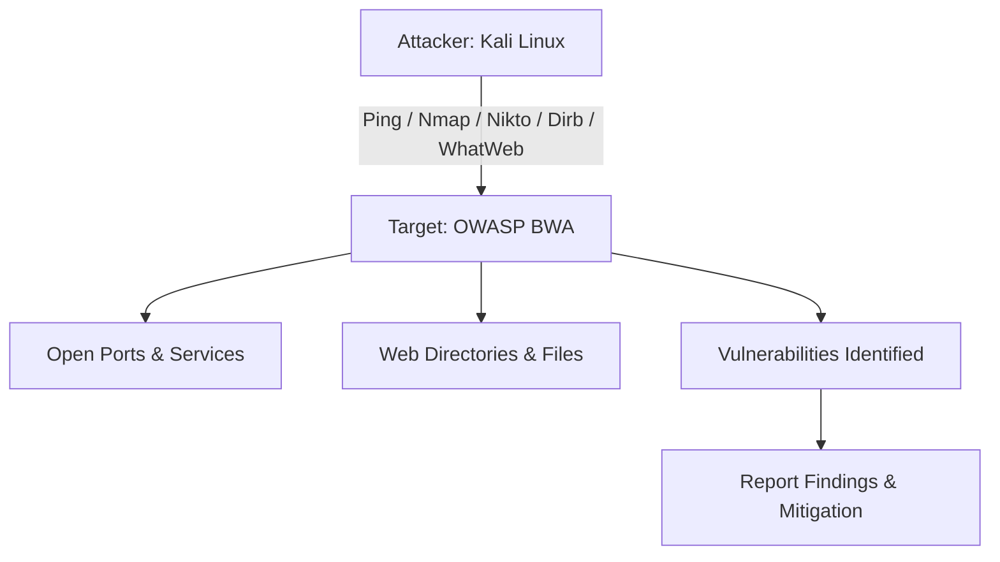

# 🌐 Information Gathering & Web Enumeration Project


## 🎯 Objective
To perform **information gathering and web enumeration** on vulnerable web applications hosted on **OWASP BWA** using tools like:  

- Nikto  
- Nmap  
- Ping  
- Nslookup  
- Host  
- Google Dorks  
- WhatWeb  
- Dirb  

---

## ⚙️ Lab Setup
1. Download and run **OWASP BWA** in VMware/VirtualBox (Bridged Adapter).  
2. Find OWASP BWA IP using `ip a` in terminal.  
3. Ensure **Kali Linux attacker machine** and **OWASP BWA target VM** can ping each other.  

---

## 🚀 Project Steps

### 1️⃣ Ping the Target
```bash
ping <OWASP-BWA-IP>
```

### 2️⃣ DNS Enumeration
```bash
nslookup <OWASP-BWA-IP>
host <OWASP-BWA-IP>
```

### 3️⃣ Nmap Scans
```bash
nmap -sS <OWASP-BWA-IP>          # Basic Scan
nmap -A <OWASP-BWA-IP>           # Aggressive Scan
nmap --script vuln <OWASP-BWA-IP> # Vulnerability Scan
```

### 4️⃣ WhatWeb Scan
```bash
whatweb http://<OWASP-BWA-IP>
```

### 5️⃣ Directory Brute Forcing (Dirb)
```bash
dirb http://<OWASP-BWA-IP>
```

### 6️⃣ Vulnerability Scan (Nikto)
```bash
nikto -h http://<OWASP-BWA-IP>
```

### 7️⃣ Google Dorks (Browser)
Examples:  
```
site:<target>  
inurl:admin  
intitle:"index of"  
filetype:php  
```

---

## 📂 Deliverables
- Screenshots of each command and result.  
- Documented observations (open ports, web technologies, directories, vulnerabilities).  
- Final Report (PDF/DOCX) containing:  
  - Introduction  
  - Methodology  
  - Tools Used  
  - Findings  
  - Conclusion  

---

## 💡 Bonus Tips
- Use `-oN result.txt` in Nmap to save results.  
- Compare findings across tools.  
- Add mitigation steps or charts for professional reporting.  

---

## 📊 Attack Workflow Diagram


